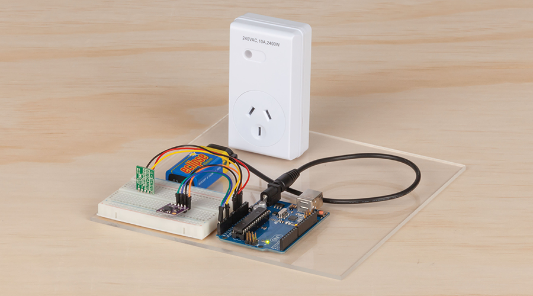

# Hand Gesture Power socket

Wax-on Wax-off lighting, just like karate kid! Use this gesture controlled powerpoint kit as a fun way to turn on power sockets around your house. Connect it to lights, fans, or even the TV and amaze your friends by turning them on with a simple wave of the hand. Uses the small [XC3742](https://jaycar.com.au/p/XC3742) Gesture module with the easy [ZW3100](https://jaycar.com.au/p/ZW3100) transmitter, controlled by arduino.

## Bill Of Materials

| Qty | Code                                     | Description         |
| --- | ---------------------------------------- | ------------------- |
| 1   | [XC4410](https://jaycar.com.au/p/XC4410) | Uno Main board      |
| 1   | [XC3742](https://jaycar.com.au/p/XC3742) | Hand Gesture sensor |
| 1   | [ZW3100](https://jaycar.com.au/p/ZW3100) | 433 Transmitter     |
| 1   | [PH9251](https://jaycar.com.au/p/PH9251) | Battery snap        |
| 1   | [SB2423](https://jaycar.com.au/p/SB2423) | 9V battery          |
| 1   | [MS6149](https://jaycar.com.au/p/MS6149) | RF Mains outlet     |

### Extra ideas
- [MS6147](https://jaycar.com.au/p/MS6147) 3 More power points
  - Set up different directions, up for the tv, down for the stereo, and add more powerpoints to your project
- [XC4419](https://jaycar.com.au/p/XC4419) Low voltage relay module
  - Lower voltage items (not on 240v)
- [AB3452](https://jaycar.com.au/p/AB3452) Buzzer
  - Audio feedback
- [XC4499](https://jaycar.com.au/p/XC4499) 8x8 Dot matrix display
  - Visual Feedback

## How to build

For instructions, check out https://jaycar.com.au/gesture-controlled-ppoint

